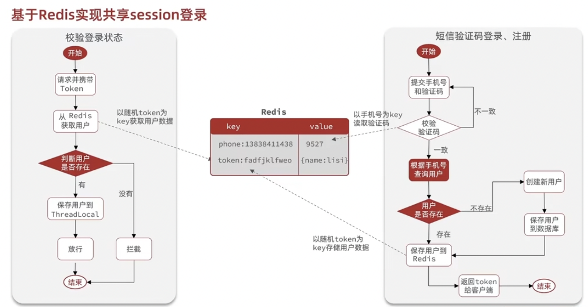
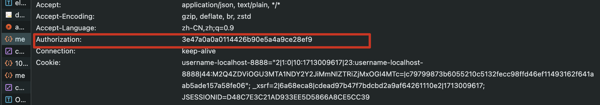
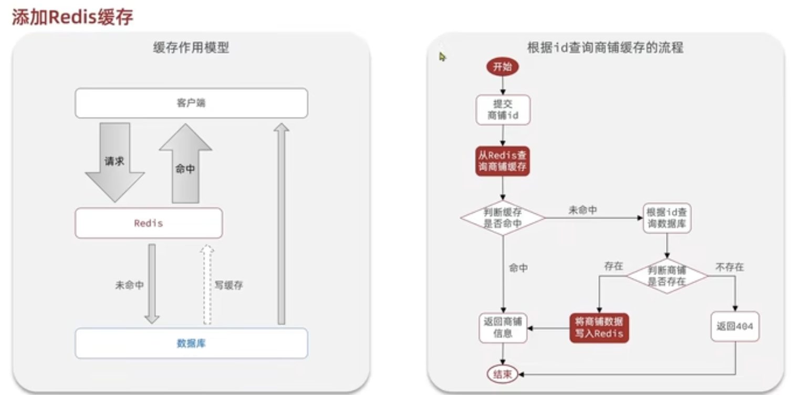
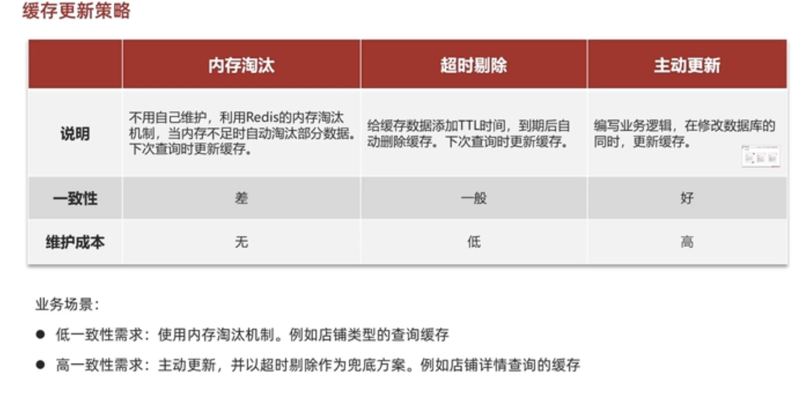
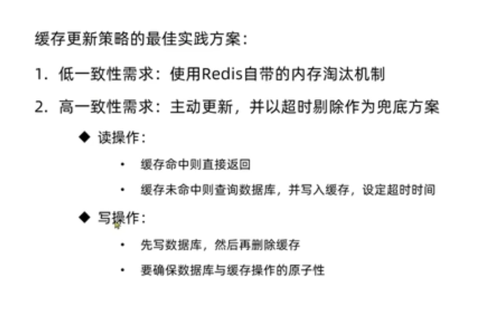

## 记录以下功能知识点
- 短信登录
- 商户查询缓存
- 优惠券秒杀
- 达人探店
- 好友关注
- 附近商户
- 用户签到
- UV统计

项目介绍：导入了已有的前端和数据库表

### 短信登录

首先使用了session携带用户id，从而实现登陆校验。但是由于未来可能不止一个tomcat服务器，而是服务器集群，于是不能再只使用session，因为验证码可能会保存到其他access不到的服务器里。而是引入了redis数据库来存储验证码，token来存储用户信息。

#### 出现问题——为什么用户实现了登录之后，点回“我的”页面，竟然闪退回到了重新登录的页面？
- 寻找错误的方向：
    - 1. 查看拦截器
    - 2. 检查token有没有起作用
    - 3. 检查一下ThreadLocal
    - 4. 检查一下UserController里面的me方法

- 最终得出的结论：
    - 错在没有在impl里面login方法返回token，反而是返回的user对象。前端只想要token。
    下图是成功后的/user/me页面
    

**ThreadLocal知识点**
- **ThreadLocal可以在短信登录中担任登陆校验时拦截器处传递用户id。**
- ThreadLocal是Java中的一个类，用于创建线程局部变量。
- 线程局部变量是指每个线程都有自己的变量副本，互相之间不会影响。
- 通过ThreadLocal类，可以在多线程环境下方便地实现线程私有的变量存储。
- 每个线程可以通过ThreadLocal对象的get()和set()方法来访问和修改自己的局部变量副本，而不会影响其他线程的副本。
- 这在一些需要在多线程中共享数据，但又需要保持数据独立性的场景中非常有用。
- ThreadLocal在实现线程封闭性、线程安全性等方面有很好的应用。

**BeanUtils知识点**
- BeanUtils在将对象转为hashmap存储进redis时可以使用转化为map的功能。
- JavaBean是一种符合特定约定的Java类，通常用于封装数据。
- BeanUtils库可以帮助开发人员在不需要手动编写大量代码的情况下，对JavaBean进行复制、克隆、属性拷贝等操作。 
- 通过BeanUtils，开发人员可以更加方便地处理JavaBean之间的数据传输和转换。

### 商户查询缓存
#### 查询流程
先在缓存里找商户数据getById, 如果缓存里没有该商户数据，就进入数据库查找。如果数据库里没有该数据，则返回不存在；否则，将数据写入redis，然后返回该数据。
在这里会用到StringRedisTemplate，使用StrUtil.isBlank(shopJson)验证redis缓存是否存在; 用JSONUtil.toBean(shopJson,Shop.class)来装填string为Bean; 用JSONUtil.toJsonStr(shop)来装填bean为string, 因为数据库查到的东西是shop对象。

#### 自行实现商户列表查询缓存
最开始没看懂实现需求，以为是要将每种类型点击进去的商铺信息列表进行缓存。后来发现只是将十种商户类型列表进行缓存，那问题就好办了。可以用list也可以用string，在这里我使用了string。
操作步骤如下:
- 第一步，进入ShopTypeController找到@GetMapping("list")
- 第二步，看清楚该方法要的返回值是Result,而前端要的是列表，所以Result里面的返回值是List类型
- 第三步，在接口里加方法，在iplm里面实现方法
- 第四步，在RedisConstants里面声明CACHE_TYPE_KEY，作为redis里面存储商户列表的key
- 第五步，redis缓存里存的是string，数据库查出来的是List<ShopType>，因此需要类型转换。JSONUtil.toJsonStr将list转成string，JSONUtil.toList将string转为list.

#### 缓存的更新策略

