## redis基础知识点

#### 官方文档
[redis文档](https://redis.io/docs/latest/commands/)

#### redis常见命令

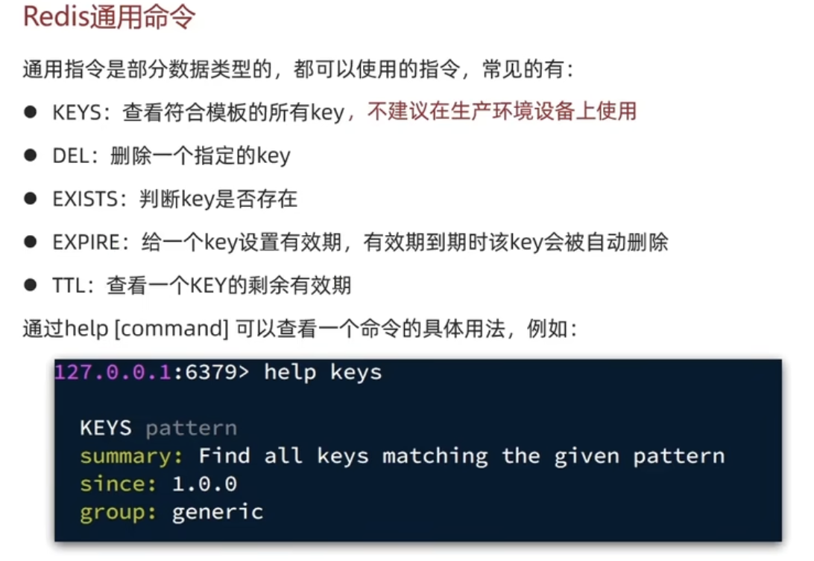

#### redis常见数据结构
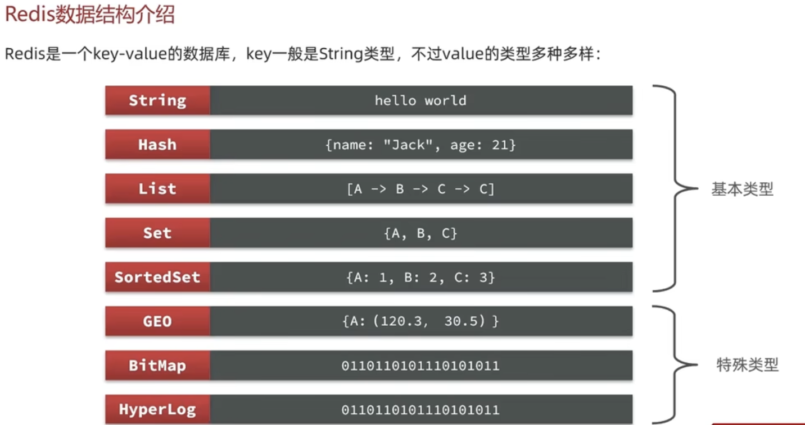

#### key的层级模式
- 用冒号隔开
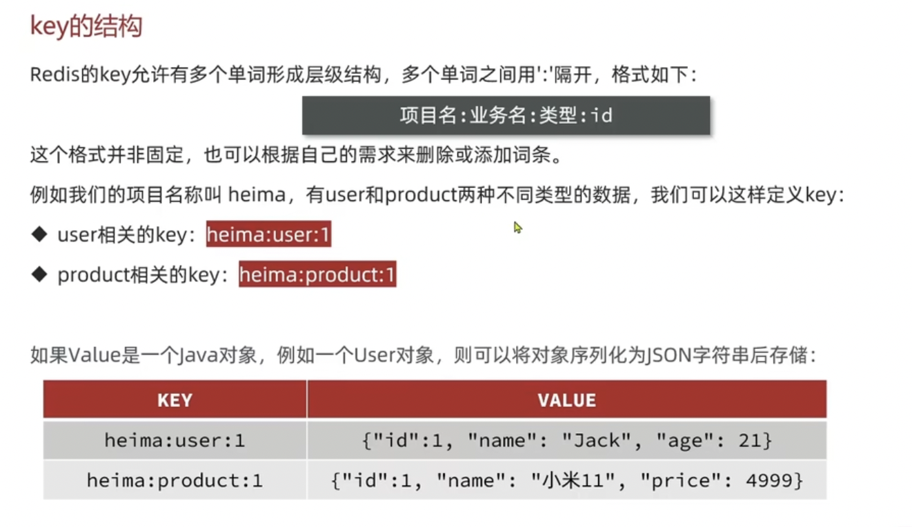

#### String类型

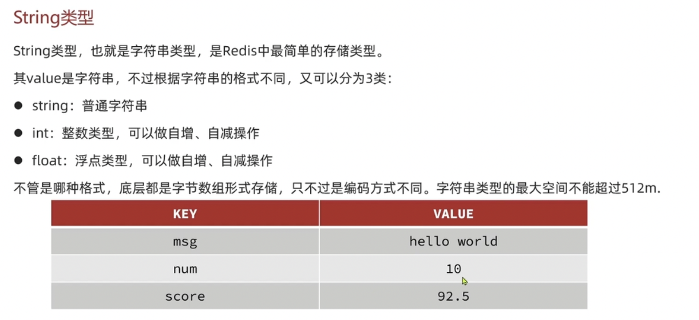

##### String类型常见命令
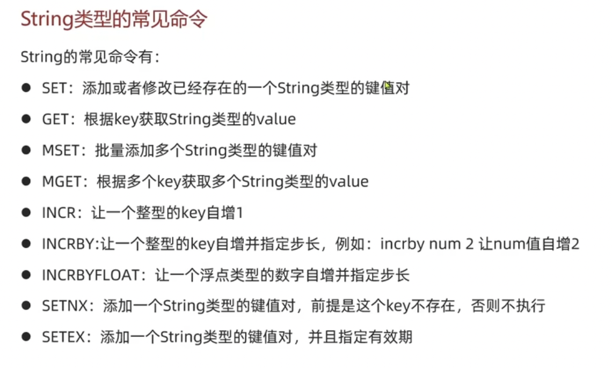

#### Hash类型
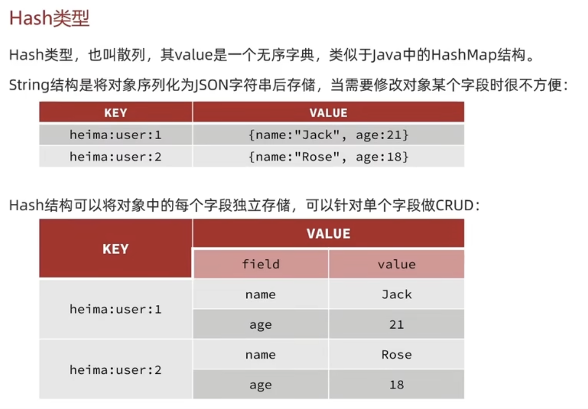

##### Hash类型常见命令
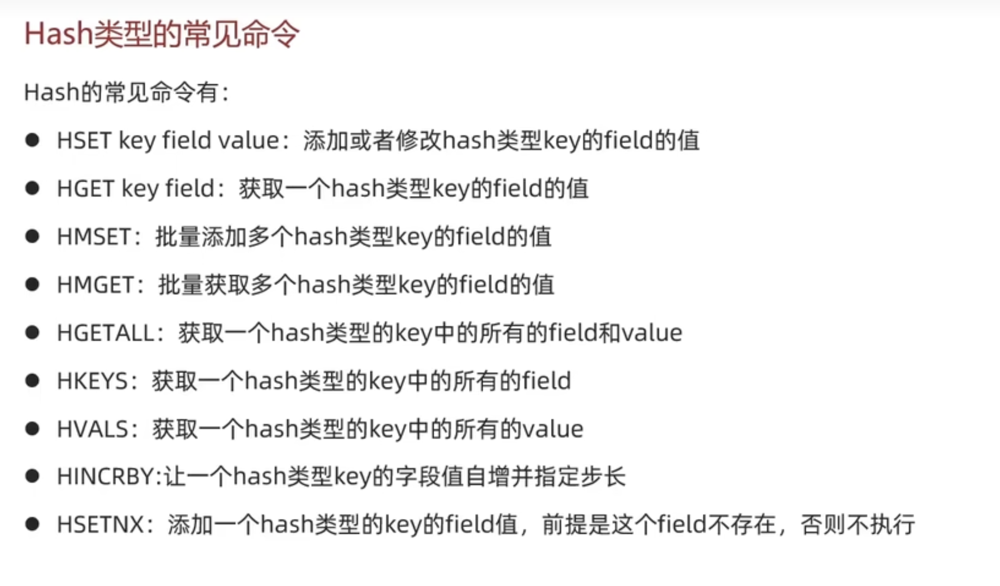

#### List类型
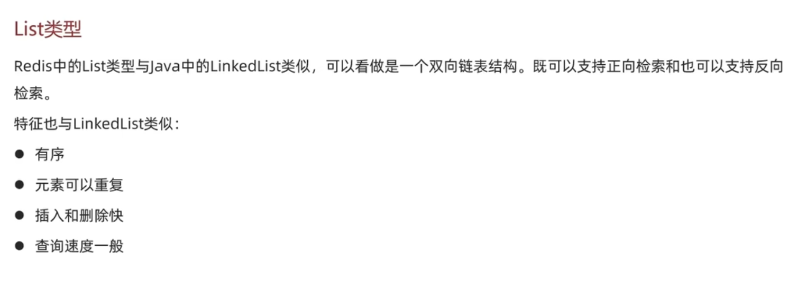
##### List常见命令
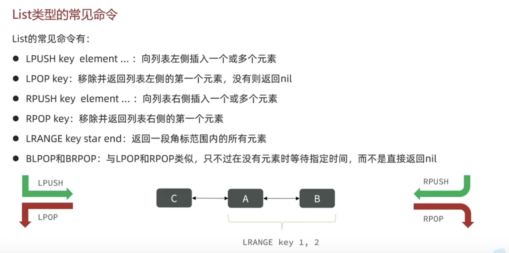

#### Set类型
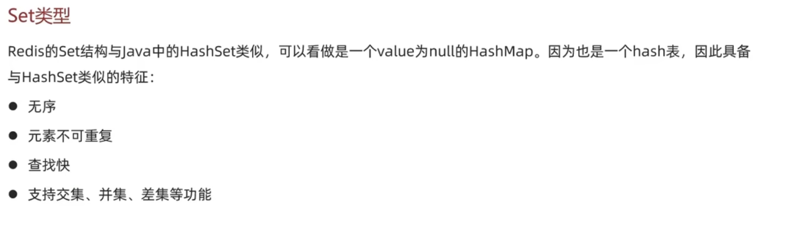

##### Set类型常见命令
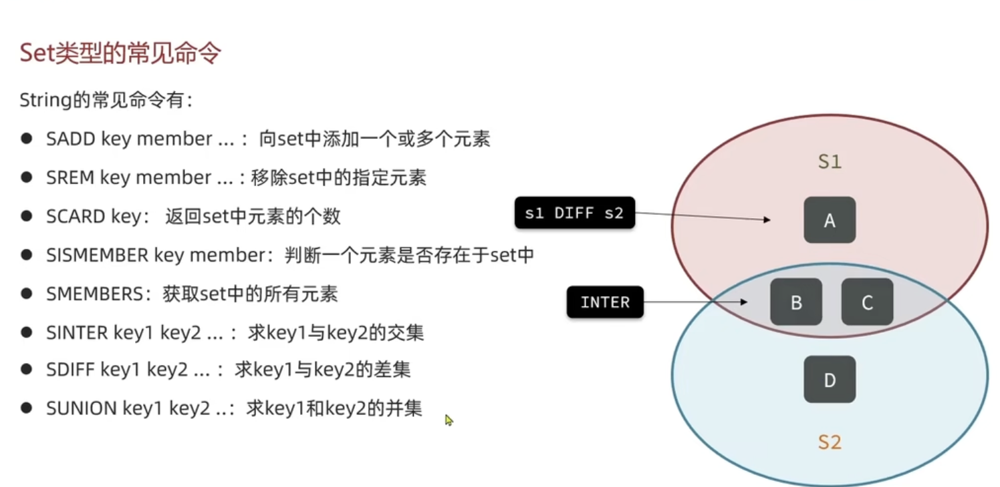

#### SortSet类型
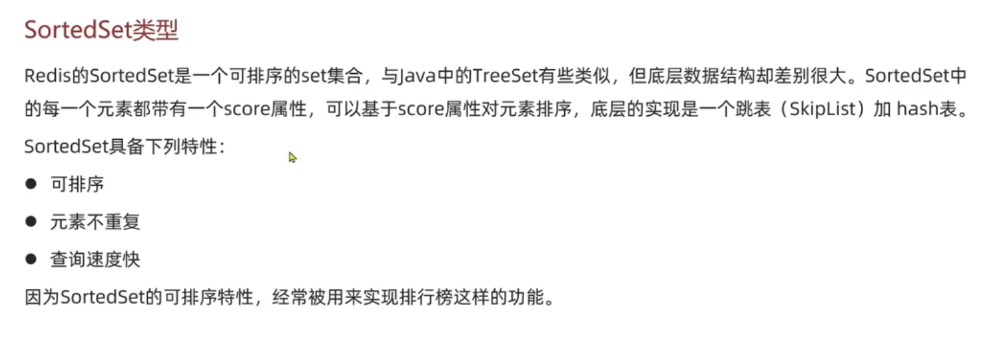

##### SortedSet类型常见命令
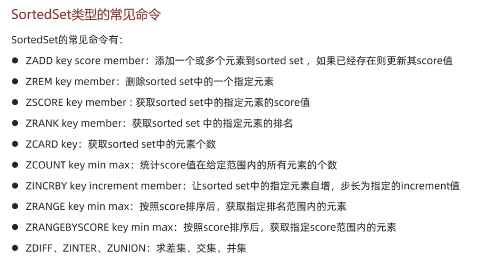

### redis的Java客户端
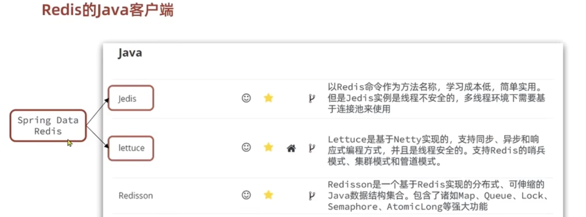

#### jedis
有两种方法连接redis，一种是jedis直连redis，另一种是jedis连接池连接redis(保证线程安全)
##### jedis直连redis
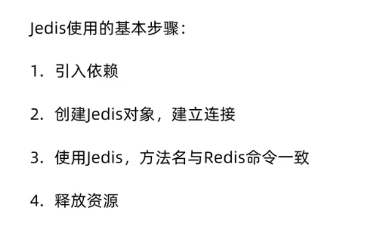
##### jedis连接池连接redis
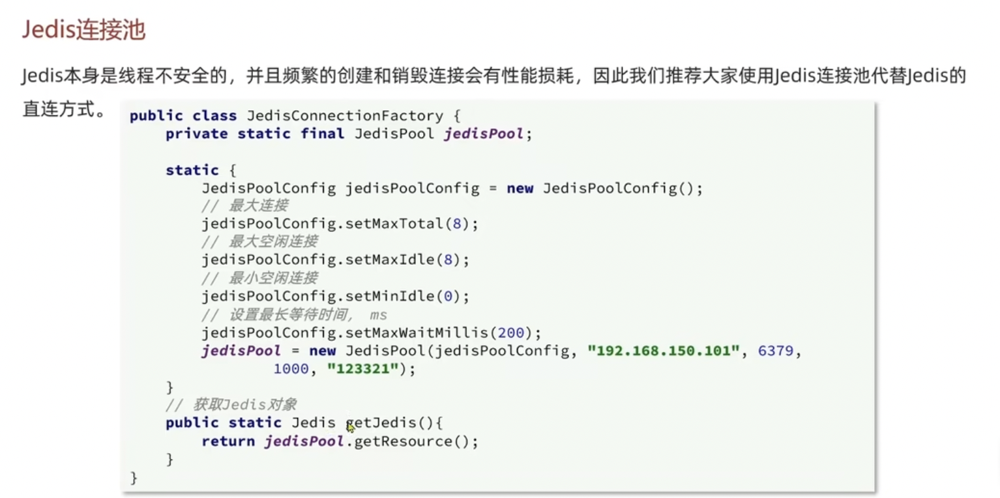

#### SpringDataRedis(Spring默认使用lettuce)
SpringData是Spring中进行数据操作的模块，包含对各种数据库的集成，其中对redis的集成模块叫做SpringDataRedis
使用了RedisTemplate统一API来操作Redis。底层有默认的序列化和反序列化，因此在传入数据时，会自动处理。
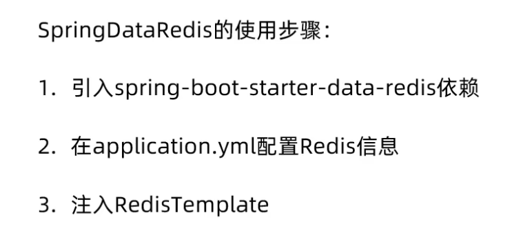
RedisTemplate中封装好的对redis的操作
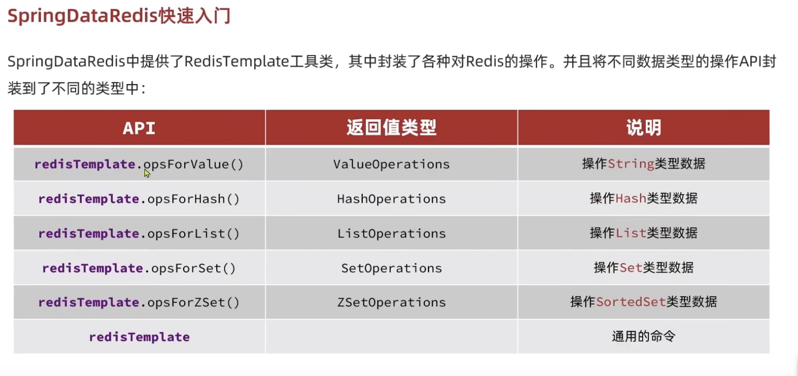

#### RedisTemplate转StringRedisTemplate
为了节省内存，一般不使用JSON序列器来处理value。而是使用统一的String序列化器，该序列化器要求只能存储String类型的key和value。当需要存储Java对象时，手动完成对象的序列化和反序列化。
如果要手动序列化，需要ObjectMapper类, 调用writeValueAsString来序列化，用readValue(str, XXX.class)来反序列化
## redis基本demo的知识点

#### 查看类源码反编译mac的快捷键： 
- 按住command点击 或者 光标放在类上command+b
- 查看接口的层次结构：control+h

#### 使用单元测试
- 在springboot中，对于JUnit框架具有以下常用注解
  - @ BeforeEach
    - 用于标记在每个测试方法执行前需要执行的方法。这可以用来初始化测试数据、创建对象实例等操作
  - @ AfterEach
    - 用于标记在每个测试方法执行后需要执行的方法。这可以用来清理测试数据、释放资源等操作
    - 单元测试的常用框架
  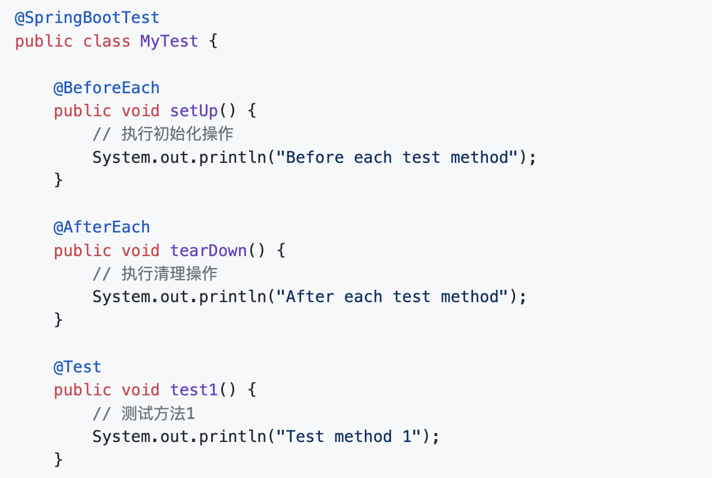

#### 关于RedisTemplate的源码解读
RedisTemplate对于传入的数据没有要求，默认序列化为字节形式，采用的是JDK序列化，因此对于String类型的数据无法直接使用。
缺点在于：1.可读性差  2.内存大
它具有的序列化工具包括：
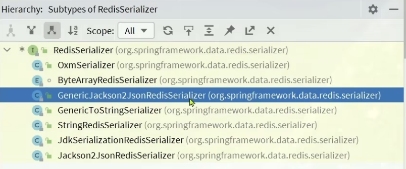
- 对于key，一般使用StringRedisSerializer
- 对于value，一般使用GenericJackson2JsonRedisSerializer
- 自定义RedisTemplate的序列化方式————
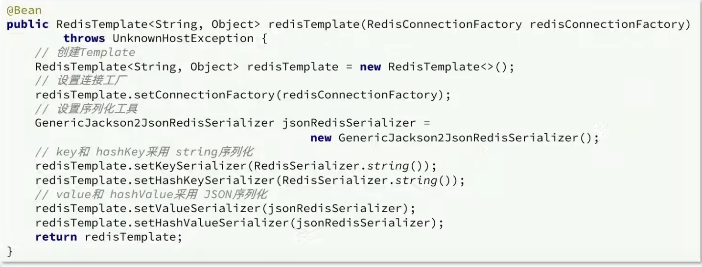
注：以上在声明的value为json的序列器时，要也可以不用声明GenericJackson2JsonRedisSerializer，直接使用RedisSerializer.json()即可。
